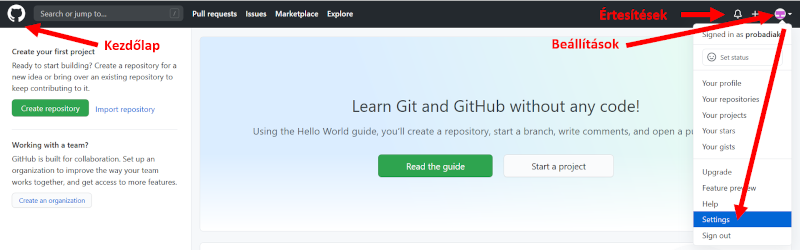

# GitHub
A Git működésének lényege, hogy a repoinkat egy szerveren tároljuk. De milyen szerveren? Mivel a Git egy nyílt forráskódú szoftver, csinálhatunk sajátot, de mi inkább GitHubot fogjuk használni.

A GitHub egy repository tárhelyszolgáltatás, így nem kell saját szervert üzemeltetnünk. Bár vannak fizetős szolgáltatások, az ingyenes része nekünk bőven elég. A repoinkat tarthatjuk privátan vagy publikussá tehetjük őket. Az utóbbi fontos része a GitHubnak, mivel egy nyílt fejlesztői közösségként is funkcionál. A nyílt forráskódú szoftverek jó része, köztük R package-k kódja elérhető itt. Ezekről akár egy saját másolatot készíthetünk, amit szabadon átalakíthatunk. Erről bővebben később.

# Regisztráljunk Githubra!
Regisztrálni a [GitHub.com](https://github.com) oldalon tudunk a Sign up menüpont alatt!

A továbbiakban a GitHub működését és használatát mutatjuk be, de magán az oldalon is rengeteg oktatási anyag található a [lab.github.com](https://lab.github.com/) és a [guides.github.com](https://guides.github.com/) címeken.

# Beállítások
Regisztráció és bejelentkezés után az alábbi képernyő fogad minket:

A jobb felső sarokban a felhasználói profilunk ikonjára kattintva érhetjük el a beállításokat. Erre még az RStudioval való összekapcsolás során szükségünk lesz!