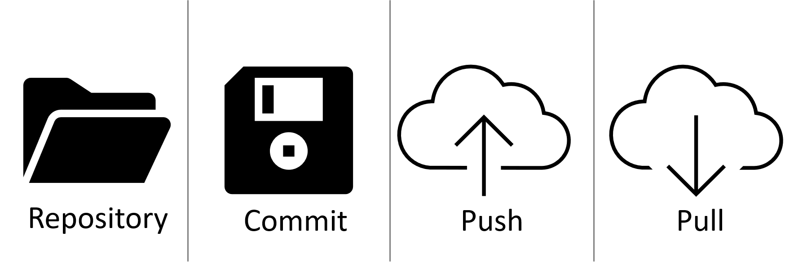

# Mi az a verziókövetés?
A verziókövetés (version control system, VCS) alatt egy olyan rendszer használatát értjük ami pontosan rögzíti és tárolja a megadott fájlokon végzett változtatásokat. Ez nagyban megkönnyíti egy projekten dolgozók együttműködését, hiszen látható hogy *ki*, *mikor*, *mit* és *miért* változtatott az adott állományon, illetve lehetővé teszi korábbi vagy párhuzamos verziók használatát.

Mi a [Git](https://git-scm.com/) nevű programot fogjuk használni, először nézzük át nagy vonalakban, hogy hogyan dolgozunk vele.

Először létrehozunk egy **repositoryt** (vagy röviden *repot*). Ez egy projekt amit a Gittel kezelünk. Van egy saját könyvtára, ebben tároljuk a projekt fájljait. Ennek a könyvtárnak egy másolata megvan lokálisan számítógépünkön és egy központi szerveren is. Az RStudioban létrehozott projektjeink is önálló repositoryk lesznek. 

Dolgozunk a projekten: fájlokat módosítunk, törlünk vagy hozunk létre. Ezeket szabadon menthetjük, ahogy bármikor. A változtatásaink a verziókövető rendszerbe való rögzítését **commitnak** hívjuk. Ekkor a program összehasonlítja fájl jelenlegi állapotát az előző verzióval, és egy újat hoz létre. Ehhez csatolhatunk egy leírást, ahol jelezhetjük, hogy mit változtattunk. Ezt a lépést érdemes sűrűn elvégezni, hogy az egyes változtatások könnyen követhetőek legyenek. Ha hibát vétünk, vagy csak erre van szükségünk a fájlok állapotát visszaállíthatjuk egy korábbi commitnál létrehozott verzióra. 

A **push** a repository központi szerveren tárolt verziójának frissítését jelenti a saját gépünkről, magyarán feltöltjük a változtatásainkat. Ha ezt nem tesszük meg, a többiek nem fogják elérni az általunk készített verziókat.

A központi szerverről mi is frissíthetjük a repónkat az aktuális verzióra, ez a **pull**.

*Verziókövetés alapok. Tárold a fájlokat egy repositoryban, vezesd a változtatásokat (commit), töltsd fel másoknak (push), frissítsd a sajátod (pull).*

A Git működését úgyis elképzelhetjük, mintha Dropboxot/OneDrive-ot/Google drive-ot használnánk annyi különbséggel, hogy itt a felhőbe való feltöltést mi indítjuk kézzel és fejlettebb eszközeink vannak a verziók kezelésére és a közös munkára.

Ezek voltak az alapok, a részletekkel az anyag további részében ismerkedünk meg.
